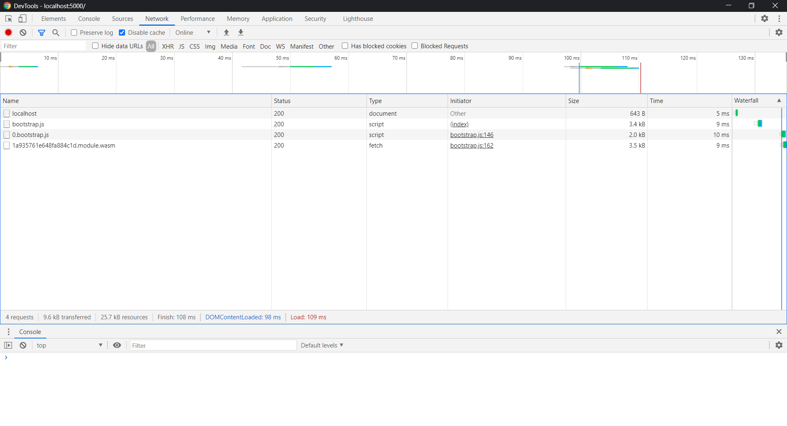
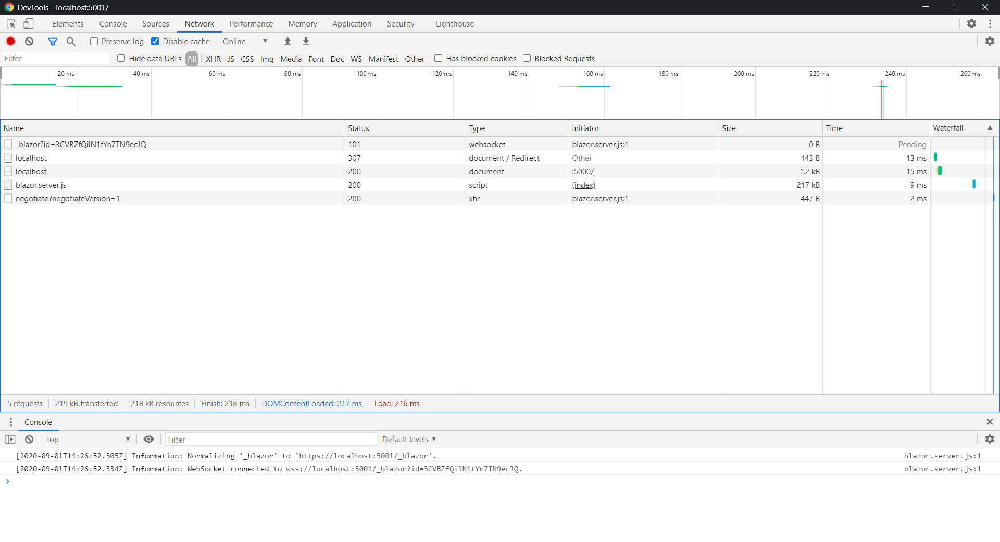
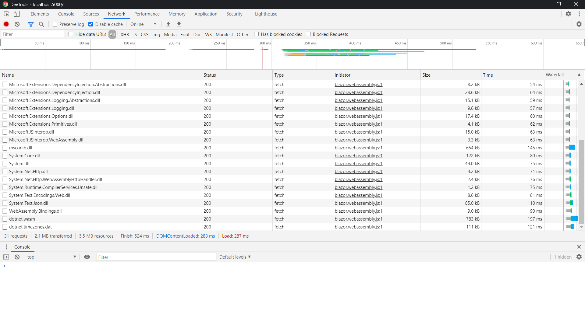

# WASM-Compare 

## Main Goal

Compare a tiny webassembly application in different langagues.
There are multiple wasm compiler. We will have a closer look a the rust (wasm-pack) and blazor (C#).

### Wasm Pack

Github: https://github.com/rustwasm/wasm-pack

Langage: [Rust](https://www.rust-lang.org/)

Pre requires: 
* [Rust tool chain](https://www.rust-lang.org/tools/install)
* [wasm-pack](https://rustwasm.github.io/wasm-pack/installer/)

Launch instruction: 
* Build the wasm binary
  * ``cargo build && wasm-pack build``
* Run webpack dev server
  * ``cd www``
  * ``npm i && npm start``
* Browse http://localhost:8080

### Blazor Server & Wasm

Github: [Asp.net Core](https://github.com/dotnet/aspnetcore)

Langage: [C#](https://docs.microsoft.com/fr-fr/dotnet/csharp/)

Pre requires: [dotnet](https://dotnet.microsoft.com/download)

Launch instruction:
* run the server
  * ```dotnet run``
* Browse http://localhost:5000 || https://localhost:5001

## Results

### wasm pack (with npm serve)


### blazor server (with kestrel and release config)


### blazor wasm (with kestrel and release config)
